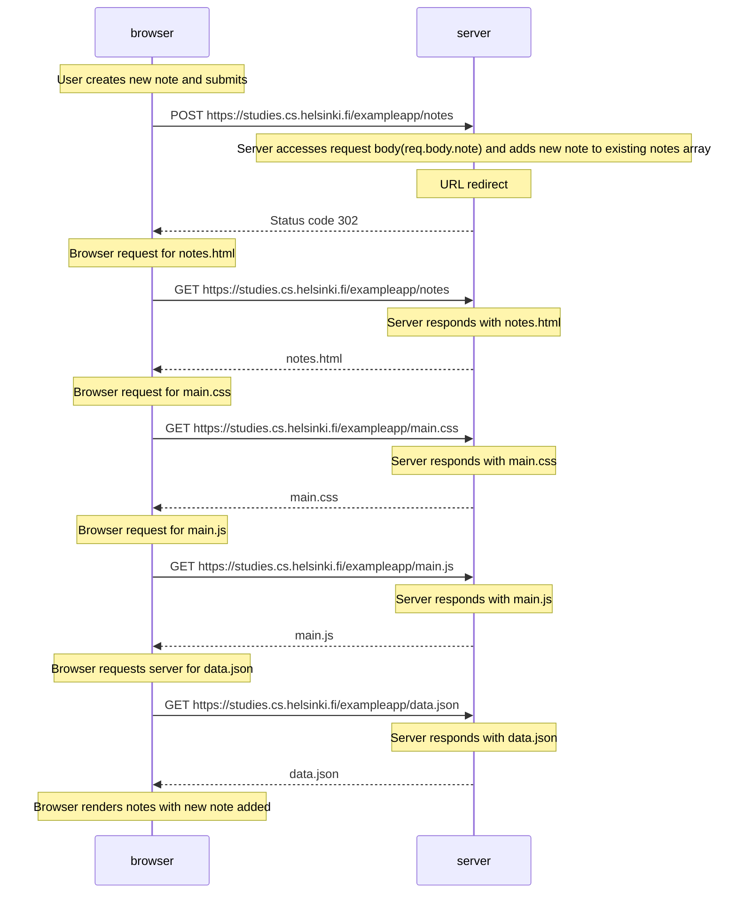

```mermaid
sequenceDiagram
participant browser
participant server

    Note over browser: User creates new note and submits

    browser->>server: POST https://studies.cs.helsinki.fi/exampleapp/notes

    Note over server: Server accesses request body(req.body.note) and adds new note to existing notes array

    Note over server: URL redirect

    server-->>browser:  Status code 302

    Note over browser: Browser request for notes.html

    browser->>server: GET https://studies.cs.helsinki.fi/exampleapp/notes

    Note over server: Server responds with notes.html

    server-->>browser: notes.html

    Note over browser: Browser request for main.css

    browser->>server: GET https://studies.cs.helsinki.fi/exampleapp/main.css

    Note over server: Server responds with main.css

    server-->>browser: main.css

    Note over browser: Browser request for main.js

    browser->>server: GET https://studies.cs.helsinki.fi/exampleapp/main.js

    Note over server: Server responds with main.js

    server-->>browser: main.js

    Note over browser: Browser requests server for data.json

    browser->>server: GET https://studies.cs.helsinki.fi/exampleapp/data.json

    Note over server: Server responds with data.json

    server-->>browser: data.json

    Note over browser: Browser renders notes with new note added
```
