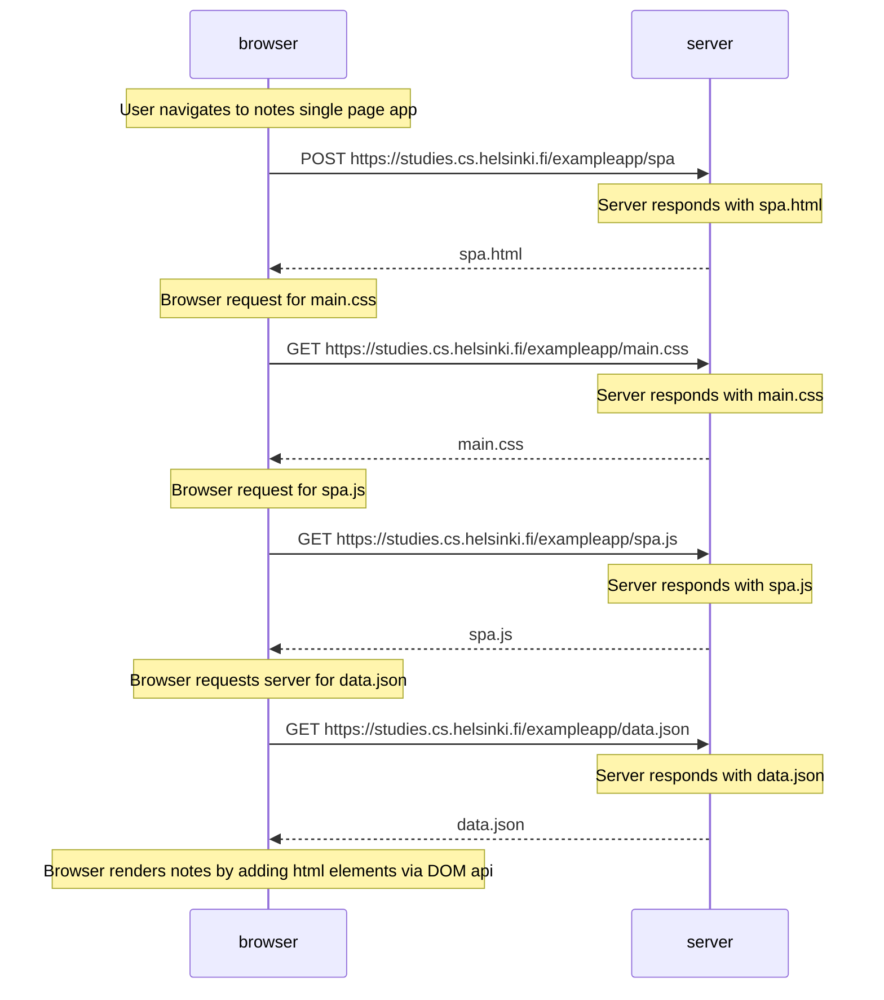

```mermaid
sequenceDiagram
participant browser
participant server

    Note over browser: User navigates to  notes single page app

    browser->>server: POST https://studies.cs.helsinki.fi/exampleapp/spa

    Note over server: Server responds with spa.html

    server-->>browser:  spa.html

    Note over browser: Browser request for main.css

    browser->>server: GET https://studies.cs.helsinki.fi/exampleapp/main.css

    Note over server: Server responds with main.css

    server-->>browser: main.css

    Note over browser: Browser request for spa.js

    browser->>server: GET https://studies.cs.helsinki.fi/exampleapp/spa.js

    Note over server: Server responds with spa.js

    server-->>browser: spa.js

    Note over browser: Browser requests server for data.json

    browser->>server: GET https://studies.cs.helsinki.fi/exampleapp/data.json

    Note over server: Server responds with data.json

    server-->>browser: data.json

    Note over browser: Browser renders notes by adding html elements via DOM api
```
