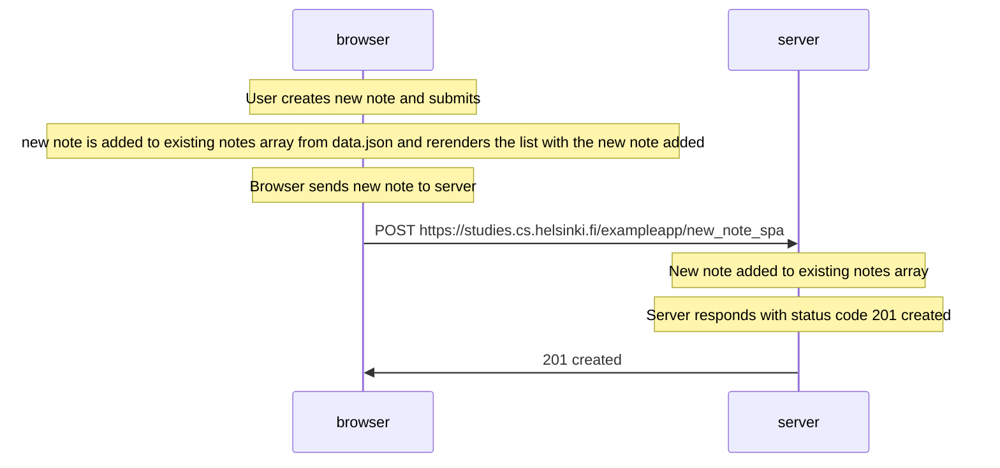

```mermaid
sequenceDiagram
participant browser
participant server

    Note over browser: User creates new note and submits

    Note over browser: new note is added to existing notes array from data.json and rerenders the list with the new note added

    Note over browser: Browser sends new note to server

    browser->>server: POST https://studies.cs.helsinki.fi/exampleapp/new_note_spa

    Note over server: New note added to existing notes array

    Note over server: Server responds with status code 201 created

    server->>browser: 201 created


```
